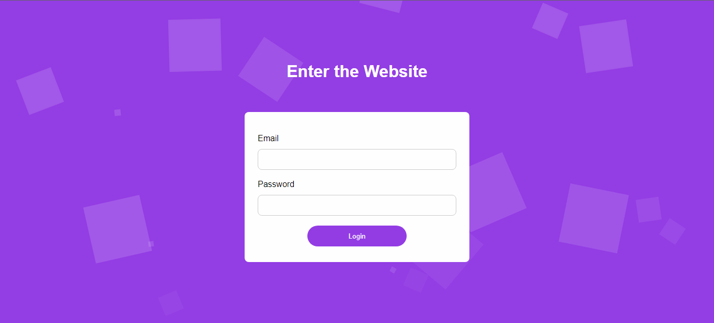

# Animated Form 

Form Page using CSS Animation and JS

🚀Completed ✅

## Table of Contents 

- [About the Project](#-about)
- [Screenshots](#-screenshots)
- [Get Started](#-get-started)
- [Features](#-features)
- [How to Contribue](#-get-started)
- [Author](#-author)
- [License](#-licence)

## 💻 About

This project consists of a simple form page with css animations and is designed to practice animating dynamic forms using CSS and JavaScript. The project was developed based on a Rocketseat tutorial on Youtube, but with some modifications.

## 🎨 Screenshots
### Desktop / Laptop 

## 🚀 Get Started 
To clone, use, modify and contribuite to this project, you just need basic knowledge of [Git](https://git-scm.com/), HTML, CSS and JavaScript, plus a code editor like [Visual Studio Code](https://code.visualstudio.com/).
## 🛠 Features
The following tools were used in the construction of the project:

- [HTML5](https://developer.mozilla.org/pt-BR/docs/Web/HTML)
- [CSS3](https://developer.mozilla.org/pt-BR/docs/Web/CSS)
- [JavaScript](https://www.javascript.com/) 

## 💪 How to Contribuite
1. Fork the project.

2. Create a new branch with your changes: `git checkout -b my-feature` 

3. Save the changes and create a commit message telling you what you've done: `git commit -m "feature: My new feature"`

4. Submit your changes: `git push origin my-feature`

## 🦸 Author
Made with ❤️ by Gustavo Souza. 👋 [Get in touch](https://www.linkedin.com/in/gustavo-victor-575b93206/)

- GitHub - [@Gustavo-Victor](https://github.com/Gustavo-Victor)
- Frontend Mentor - [@Gustavo-Victor](https://www.frontendmentor.io/profile/Gustavo-Victor)
- CodePen - [@gustavo_victor](https://codepen.io/gustavo_victor)
- Linkedin - [@gustavo-victor](https://www.linkedin.com/in/gustavo-victor-575b93206/)

## 📝Licence 
This project is under the [MIT license](./LICENSE).

Anyone can use, clone, fork and contribute to this project.

